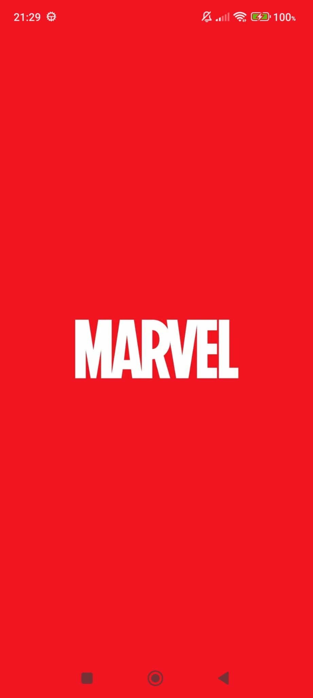
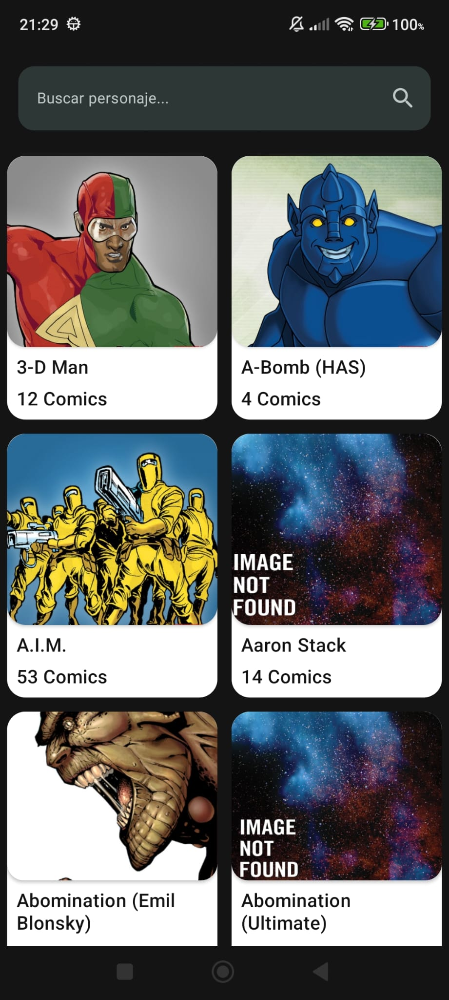
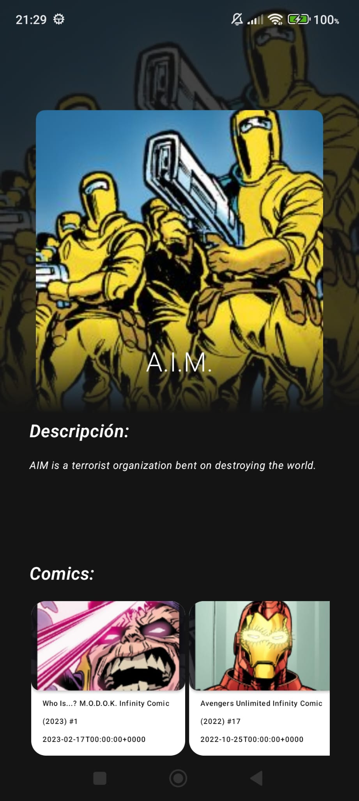

# MARVEL API - MVVM - HILT - JETPACK COMPOSE

    
    
    
  

# Technologies used in this app
- JetpackCompose
- Presentation architecture -> MVVM
- Architecture -> Clean
- Json Converter -> Gson
- HTTP Client -> Retrofit2
- Database -> Room
- Dependency injection -> Dagger Hilt
- Unit Testing -> Mockk
- Integration Testing
- E2E Testing

# Credits
- [Marvel API](https://developer.marvel.com/)
